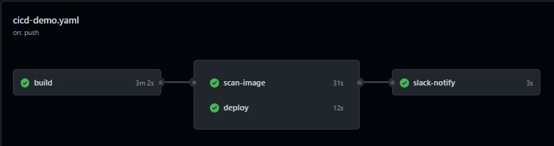
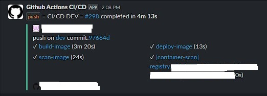

# Github Actions for React application

This folder contains sample files using Github Actions for React applications (not including application source here).

## 1. File location

You will place the following files in the source directory of your React application.

- `.dockerignore`
- `.env`
- `Dockerfile`
- `nginx.conf`

For the file `cicd.yml`, you put it in the `.github/workflows` folder in the React application source directory.

## 2. Each `cicd.yml` file for a branch

Here I just created a sample file for the `dev` branch, in fact you can copy this file and create many new files for different branches, for example:

- `cicd-qa.yml`: used for branch `qa`
- `cicd-stg.yml`: used for branch `staging`
- `cicd-main.yml`: used for branch `main`

## 3. What is the CI/CD process like?

The Github Actions steps will be as follows:

- Get version information from `package.json` file
- Build Docker image from `Dockerfile`
- Push the newly created image to the Nexus registry (Nexus is installed separately)
- Scan image to detect vulnerabilities
- Deploy image to Dev server via SSH connection
- Send notifications to Slack channel

All secret values in the `cicd.yml` file are stored in Github Secrets. You can find string `${{ secrets.` in the file to see all secrets.

## 4. Images

- The Github Action flow like this:

    

- Slack notification like this:

    